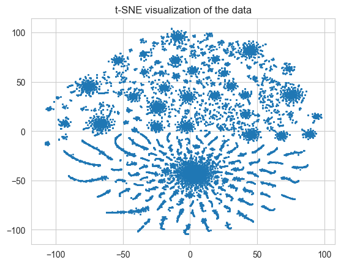

# Kaggle Unsupervised Clustering Solution

Решение задачи кластеризации из соревнования на Kaggle с использованием методов машинного обучения без учителя.

## Описание задачи

Задача: предсказать метки классов для строк матрицы, представленной в формате `.npz`.

Дано:
- `data/train.npz`: спарсная матрица размером `21000 x 3049`.
- `data/sample_submission.csv`: пример файла отправки (`ID`, `TARGET`).

Цель: создать модель, которая предскажет `TARGET` как кластеры и выдаст файл `submission.csv`.

---

## Методы решения и результаты

Я исследовал несколько подходов к решению задачи, но по скору в Kaggle остановился на методе K-means.

### Промежуточный результат
- UMAP + HDBSCAN: 0.01

- DEC: 0.01

- DBSCAN: 0.24

- AutoEncoders + Kmeans: 0.0

- Kmeans: 0.575

### Лучшая модель - Kmeans

Результат в зависимости от кол-ва кластеров:

- 4 clusters: 0.426
- 5 clusters: 0.575
- 6 clusters: 0.542
- 7 clusters: 0.563

 Предполагаю, что кластеров чуть больше.

## Как использовать

1. Клонируйте репозиторий:
   ```bash
   git clone https://github.com/GercKLIM/unsuperviser.git

2. Установите необходимые зависимости:
   ```bash
   pip install numpy pandas matplotlib seaborn umap scikit-learn scipy notebook

3. Откройте и выполните Jupyter Notebook:
   ```bash
   jupyter notebook main_kmeans.ipynb

## Контакты 

Если у вас возникли вопросы по этому проекту или вы хотите обсудить сотрудничество, свяжитесь со мной:

- Email: gerceg0808@yandex.ru   
- Tg: [@GercKLIM](https://t.me/GercKLIM)
- GitHub: [@GercKLIM](https://github.com/GercKLIM)

*Примечание: Проект создан в учебных целях для демонстрации


